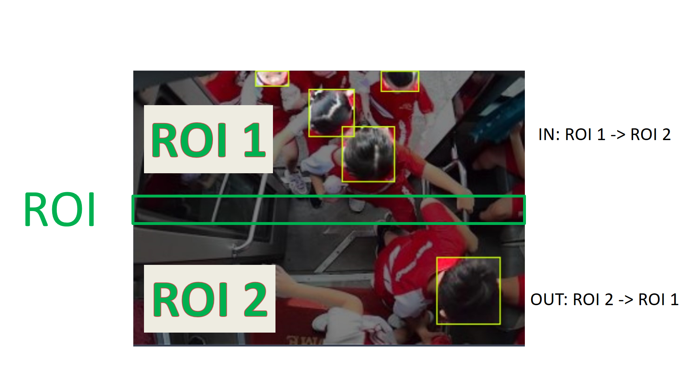
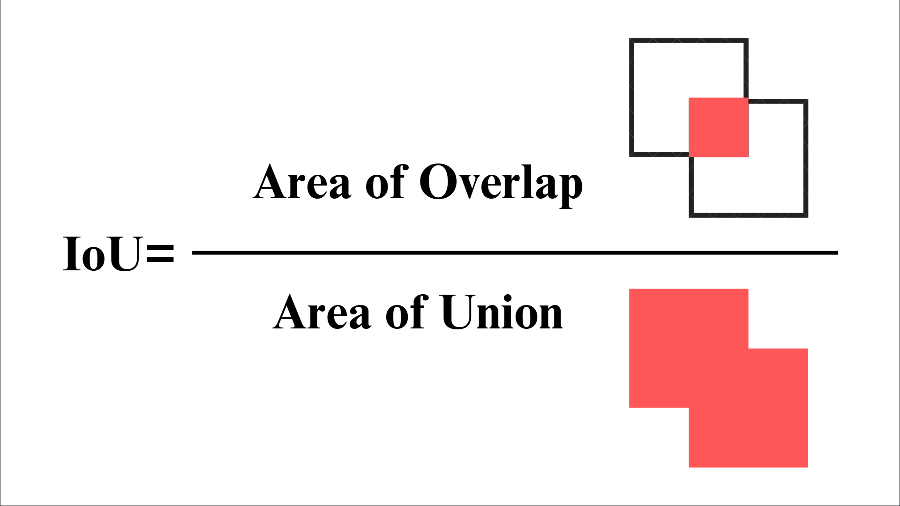

# Precise-object-counter

[](https://opensource.org/licenses/MIT)


A state-of-the-art precision counting system that combines YOLO/ONNX/CVIMODEL object detection with ByteTrack, currently the most advanced multi-object tracking algorithm, and innovative ROI-based methodology. Through extensive research and empirical validation, this implementation achieves unprecedented accuracy in bidirectional counting, particularly excelling in challenging environments where traditional methods often fail. My approach integrates real-time detection precision with ByteTrack's superior tracking capabilities, resulting in a high-precision object detection and counting system for diverse applications.

## Research Background

This project emerged from intensive research and experimentation in solving the challenging problem of precise object counting in crowded, dynamic environments. The methodology developed here addresses several critical issues in real-time object counting:

- Accurate bidirectional counting in crowded scenarios
- Robust tracking in varying lighting conditions (day/night, indoor/outdoor)
- Lightweight for hardware with limited resources and processing power
- Precise object differentiation in overlapping situations
- Real-time processing capability on embedded systems
- Adaptive performance in high-traffic environments
- Resilient tracking through occlusions and complex movements
- High accuracy in varying weather conditions (for outdoor applications)

## System Architecture

### ROI-Based Counting Methodology


*Figure 1: ROI-based counting methodology illustration*

The system employs a sophisticated Region of Interest (ROI) approach using the ROI counting equation:
```python
def obj_in_roi(obj, roi):
    x = obj.x + obj.w // 2
    y = obj.y + obj.h // 2
    if x >= roi[0] and x <= roi[0] + roi[2]:
        if y < roi[1]:
            return -1  # Above ROI
        if y > roi[1] + roi[3]:
            return 1   # Below ROI
        return 0       # Inside ROI
    return None       # Outside ROI
```
The obj_in_roi function is designed to determine an object's position relative to a defined counting zone (ROI - Region of Interest). First, it calculates the center point of the detected object by finding the middle point of its bounding box. This single point represents the object's position more reliably than using its entire area.

The function then performs two crucial checks: First, it verifies if the object is horizontally aligned with the counting zone by checking if its center X-coordinate falls within the ROI's left and right boundaries. If the object isn't horizontally aligned, it's considered outside our area of interest and ignored (returns None).

For objects that are horizontally aligned, the function then determines their vertical position by comparing their center Y-coordinate with the ROI's top and bottom boundaries. This check classifies the object's position into three categories:
- Above the counting zone (returns -1)
- Inside the counting zone (returns 0)
- Below the counting zone (returns 1)

By tracking how these position values change over time, the system can determine the direction of movement and maintain precise counts.

### Understanding IoU (Intersection over Union)


*Figure 2: IoU calculation visualization in object tracking*

The IoU metric is fundamental to my counting system's accuracy. The IoU equation plays a crucial role in our counting method's precision, particularly when integrated with ByteTrack's advanced tracking capabilities. The carefully tuned thresholds (0.45 for detection and 0.8 for tracking) provide an optimal balance between accuracy and processing efficiency, making this implementation particularly effective in challenging scenarios like school bus monitoring and crowd counting.

## Technical Parameters and Optimization

The system uses carefully tuned parameters based on extensive testing:

### Detection Parameters
```python
conf_threshold = 0.3   # Detection confidence threshold
iou_threshold = 0.45   # IoU threshold for detection
```
- **conf_threshold**: Set to 0.3 to balance between false positives and detection sensitivity
- **iou_threshold**: 0.45 provides optimal overlap detection while maintaining distinct object separation

### Tracking Parameters
```python
track_thresh = 0.4     # Tracking confidence threshold
high_thresh = 0.6      # New track addition threshold
match_thresh = 0.8     # Object matching threshold
max_history_num = 18    # Track history length
```

Parameter justification:
- **track_thresh (0.4)**: Balances tracking stability and sensitivity
- **high_thresh (0.6)**: Ensures new tracks are only created for high-confidence detections
- **match_thresh (0.8)**: High threshold ensures accurate object persistence across frames
- **max_history_num (18)**: Optimal buffer size for tracking without excessive memory usage

## Implementation Files

### 1. main.py
Primary implementation focusing on precise counting:
- Core counting functionality
- Optimized for real-time performance
- Minimal overhead for embedded systems

### 2. analyze_main.py
Enhanced version with additional statistics:
- Real-time FPS monitoring
- Performance metrics tracking
- System resource utilization
- Detailed counting analytics
- Frame processing time analysis

Statistical features include:
- Average frame processing time
- FPS variation analysis
- Memory usage tracking
- System temperature monitoring
- Counting accuracy metrics

## Hardware Compatibility

The system is designed to run on:
- RISC-V architecture (primary development platform)
- Raspberry Pi (all versions)
- Any Linux-compatible MCU/SBC

## Installation and Setup

```bash
git clone https://github.com/nhattan86/precise-object-counter.git
```

## Usage

Basic implementation:
```python
python main.py
```

Advanced analytics:
```python
python analyze.py
```

## Key Applications

### Transportation and Traffic
- **Public Transit**: 
  - Real-time passenger counting on buses, trains, and metros
  - Platform occupancy monitoring at stations
  - Queue length estimation at transit stops
- **Traffic Analysis**:
  - Vehicle counting at intersections
  - Lane usage statistics
  - Traffic flow pattern analysis
  - Pedestrian crossing frequency monitoring
- **Parking Solutions**:
  - Available parking space counting
  - Vehicle entry/exit tracking
  - Parking duration analysis

### Retail Analytics
- Customer flow analysis in supermarkets and stores
- Queue management at checkout counters
- Shopping pattern analysis
- Peak hour traffic monitoring
- Conversion rate tracking (entrance vs. purchase)

### Educational Institutions

#### Campus Safety & Monitoring
- **Attendance Tracking**:
  - Classroom occupancy monitoring
  - Library usage statistics
  - Cafeteria capacity management
  - Real-time campus population tracking
  - After-hours facility usage monitoring

#### School Transportation Safety
- **School Bus Safety System**:
  - Real-time student boarding/alighting verification
  - Missing student detection
  - Wrong stop alerts
  - Sleep child check system
  - Emergency situation monitoring
  - Unauthorized exit detection
  - Driver assistance alerts

#### Smart Attendance Solutions
- **Automated Tracking**:
  - School bus attendance logging
  - Class transition monitoring
  - Late arrival reporting
  - Early departure alerts
  - Special event attendance

#### Safety Compliance & Analytics
- **Safety Measures**:
  - Social distancing monitoring
  - Emergency evacuation counting
  - Maximum capacity enforcement
  - Suspicious behavior detection
  - Unauthorized access prevention

#### Parent Communication System
- **Real-time Updates**:
  - Bus boarding notifications
  - Arrival time estimates
  - Route delay alerts
  - Emergency situation updates
  - Location tracking services

#### Transportation Management
- **Fleet Optimization**:
  - Route efficiency analysis
  - Capacity utilization reports
  - Peak time management
  - Driver performance metrics
  - Fuel efficiency correlation

### Industrial Applications
- Production line item counting
- Warehouse inventory movement tracking
- Worker flow analysis in restricted areas
- Quality control checkpoints
- Assembly line monitoring

### Security and Safety
- Crowd density monitoring at events
- Emergency exit usage tracking
- Restricted area access monitoring
- Building occupancy compliance
- Social distance monitoring

### Smart City Applications
- Pedestrian flow analysis in urban areas
- Public space utilization metrics
- Smart building occupancy monitoring
- Public facility usage tracking
- Event crowd management

### Research and Analytics
- Behavioral studies
- Movement pattern analysis
- Traffic flow optimization
- Urban planning data collection
- Facility utilization research

## Performance Metrics

- Average FPS: 10-40 on RISC-V platform
- Average CPU Temperature : below 45 °C
- Power Consumption: <5W
- Counting Accuracy: >96% in tested scenarios, 100% accuracy can be attained with a perfectly accurate model.

## Author

Created by: nhattan86

Last Updated: 2025-01-29 22:39:12 UTC

Copyright (c) 2025 nhattan86

[](https://opensource.org/licenses/MIT)

## License

This project is licensed under the MIT License - see the [LICENSE](LICENSE) file for details.
